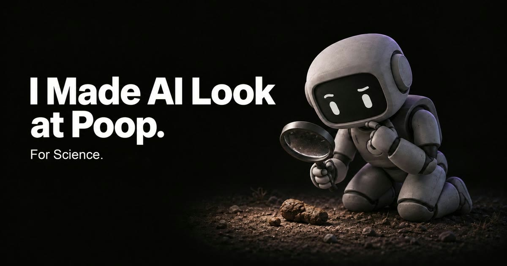
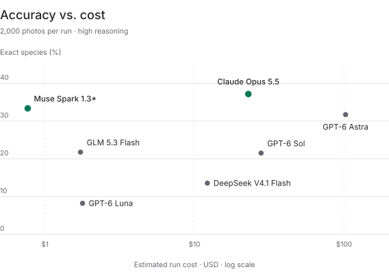
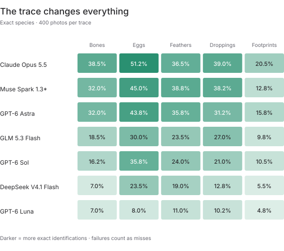
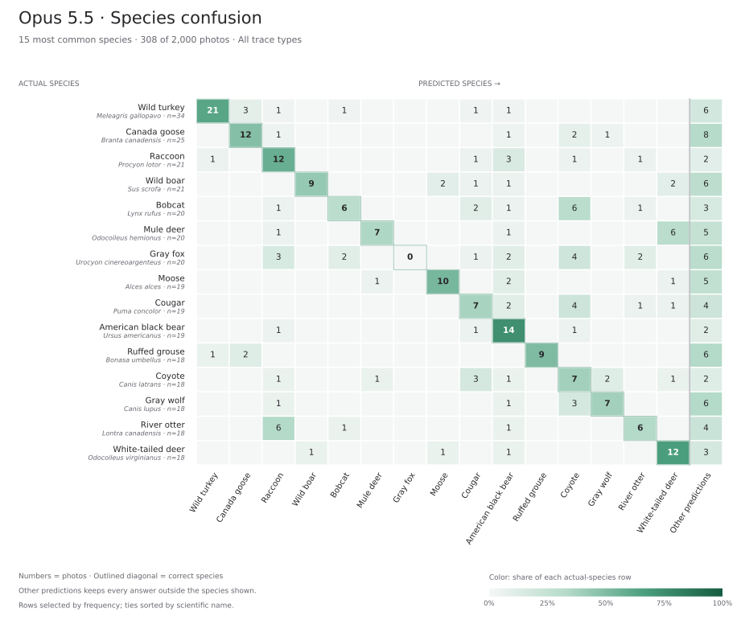
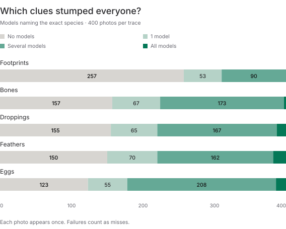

# Wildlife CSI

**2,000 photos. Five kinds of animal trace. One question: what animal left this?**

Wildlife CSI tests whether vision models can identify an animal from what it leaves behind: droppings, footprints, feathers, eggs, and bones. Each model gets one photo and its country, then makes one species guess.

The best model in these eight runs identified **37.15%** of species correctly. **842 photos** went without a correct species guess from any model.

[Read the full post on the Labqoat blog](https://labqoat.com/blog/what-animal-left-this) · [Run it yourself](src/README.md) · [All runs](runs/) · [Chart data](assets/charts/results.json)

## Accuracy versus cost

All eight models saw the same photos with **high reasoning effort**. Opus led with **743 of 2,000** species correct; Muse followed at **33.35%**, with a reported run cost of **$0.77**. Sonnet placed fourth at **25.15%**, with an estimated cost of **$7.62**.

<picture>
  <source media="(prefers-color-scheme: dark)" srcset="assets/charts/cost-dark.svg">
  <source media="(prefers-color-scheme: light)" srcset="assets/charts/cost-light.svg">
  
</picture>

Scores include all 2,000 photos, including failed calls. Costs use OpenRouter's reported charges for Muse, GLM, and DeepSeek; AWS and Azure costs are token-based estimates. The cost axis is logarithmic; the asterisk marks Muse's Contributor pricing. Unreported charges and separate scoring costs are excluded.

Scores and run files

| Model | Exact species | Genus or better | Family or better | Run cost | Evidence |
| --- | ---: | ---: | ---: | ---: | --- |
| **Claude Opus 5.5** | **37.15%** | **41.25%** | **51.75%** | $22.92 | [Run](runs/opus/) · [Scores](runs/opus/score/summary.json) |
| Muse Spark 1.3 Contributor | 33.35% | 37.55% | 48.80% | $0.77 | [Run](runs/muse/) · [Scores](runs/muse/score/summary.json) |
| GPT-6 Astra | 31.70% | 34.75% | 44.95% | $102.43 | [Run](runs/astra/) · [Scores](runs/astra/score/summary.json) |
| Claude Sonnet 5.5 | 25.15% | 28.75% | 38.70% | $7.62 | [Run](runs/sonnet/) · [Scores](runs/sonnet/score/summary.json) |
| GLM 5.3 Flash | 21.75% | 25.20% | 35.80% | $0.75 | [Run](runs/glm/) · [Scores](runs/glm/score/summary.json) |
| GPT-6 Sol | 21.50% | 24.25% | 32.55% | $27.89 | [Run](runs/gpt-6-sol/) · [Scores](runs/gpt-6-sol/score/summary.json) |
| DeepSeek V4.1 Flash | 13.55% | 16.15% | 24.15% | $9.15 | [Run](runs/deepseek/) · [Scores](runs/deepseek/score/summary.json) |
| GPT-6 Luna | 8.20% | 10.05% | 15.45% | $1.78 | [Run](runs/luna/) · [Scores](runs/luna/score/summary.json) |

Sonnet, GLM, and DeepSeek scores are provisional; see their run summaries and review queues for extractor-assisted grades.

## Footprints were the hardest

Opus identified **205 of 400 egg photos (51.25%)**, but only **82 of 400 footprints (20.50%)**. It led on every trace type except feathers, where Muse scored highest.

<picture>
  <source media="(prefers-color-scheme: dark)" srcset="assets/charts/traces-dark.svg">
  <source media="(prefers-color-scheme: light)" srcset="assets/charts/traces-light.svg">
  
</picture>

Each cell shows exact-species accuracy on 400 photos. Darker cells mean more correct identifications.

## Which species did Opus confuse?

These are the **15 most common species** in the dataset, covering **308 photos**. Opus identified 7 of 20 mule-deer photos correctly and called another 6 white-tailed deer.

<picture>
  <source media="(prefers-color-scheme: dark)" srcset="assets/charts/confusion-opus-top15-dark.svg">
  <source media="(prefers-color-scheme: light)" srcset="assets/charts/confusion-opus-top15-light.svg">
  
</picture>

Numbers are photo counts; color shows the share of each row. “Other predictions” keeps answers outside these 15 species in the totals. [Full matrix](runs/opus/score/confusion_matrix.json).

## Which clues stumped everyone?

Across all eight models, **842 of 2,000 photos (42.10%)** never received a correct species guess. That includes **257 footprints**, compared with **123 eggs**.

<picture>
  <source media="(prefers-color-scheme: dark)" srcset="assets/charts/coverage-dark.svg">
  <source media="(prefers-color-scheme: light)" srcset="assets/charts/coverage-light.svg">
  
</picture>

Each bar contains 400 photos, grouped by how many models got the species right. “Several” means more than one model but fewer than all eight.

Photos from [AnimalClue](https://huggingface.co/risashinoda). Attribution and licenses are preserved in the task records.

Want to run the benchmark yourself? The [guide in src](src/README.md) covers installation, model setup, and running and scoring your own results.
